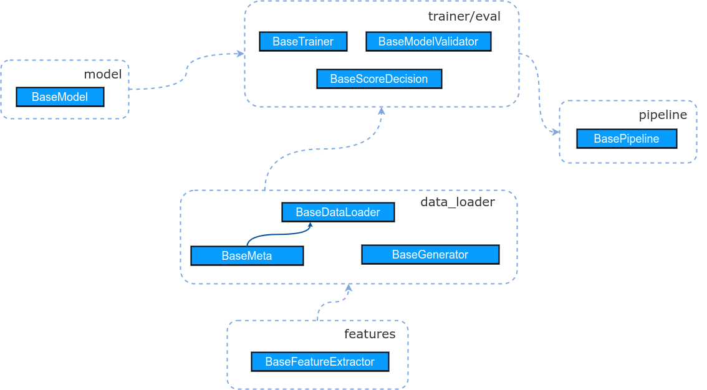

{{cookiecutter.project_name}}
==============================

{{cookiecutter.description}}

Project architecture
=============================

The main abstract classes are in `base` folder. The implementations of the abstract classes 
are in the corresponding folders.  




Structure of packages
=====================

```
├── README.md
├── base
│   ├── data_loader.py
│   ├── feature.py
│   ├── model.py
│   ├── pipeline.py
│   └── trainer.py
├── data_loader
│   
├── features
│   
├── model
│   
├── pipeline
│   
├── trainer
│   
├── utils
│   
└── visualize
```


